# Cost-Focused Weather Tracking
### (Cloud Categorization & Tracking)  

- By: Tadj Cazaubon (tc222gf) and Amirreza Dehdari (ad223fu)

## TLDR;
Quick yet accurate Weather prediction is imperative for certain industries to now only survive, but simply exist. An important factor of these is the ability to track, categorize and predict movements of clouds within a given area. Current data is not meant for real-time application on a local area level. The  proposal is the construction of a number of 'weather stations' which take atmospheric readings and images of the sky above them to accurately track cloud cover.

<br>

# Longer Story
More location-accurate, real-time weather tracking and prediction is an endeavor with wide-reaching application. These include the 
ability to better prepare for local weather conditions,
more refined weather condition description, such as duration and area of effect for storage units and warehouses, and the potential for solar panel owners to more accurately estimate power output using knowledge of cloud-cover.

These sorts of forecasts are usually made using satellite data. This would be from sources such as the MISR Level 2 Cloud product from NASA, showing cloud-motion vectors accurate to 17.6km [2], or the EUMETSAT MTG 3rd Gen. satellite array with a purported resolution of approx. 1km. [10] This data cannot be used for local weather forecasting however, as cloud-cover obscures the view of the land, as well as cloud-heights and environmental readings for overcast areas being unknowable. 

Cloud-height, visibility, humidity are usually measured on the ground via devices such as Ceilometers. This however costs an average of approx. USD $ 30,000 [3] and covers approximately 8 km^2 [12]. Ground-based techniques which utilize a visual component usually do so via the use of calibrated camera arrays performing triangulation (B.Lyu, Y.Chen et al 2021)[13], sometimes going further to separate cloud fields from the sky background to describe cloud cover in terms of both horizontal size and velocity vectors(P.Crispel, G.Roberts 2018)[14]. Techniques which do not make use of a visual component utilize environmental readings such as dewpoint and relative humidity to then calculate the Lifted Condensation Level (LCL). This is “ the height at which an air parcel would saturate if lifted adiabatically ” [9] and can be used as a approximate stand-in for the base-height of a cloud in a given area. This approach may be able to act as a stand-in for areas unable to install a ceilometer, depending on the sensor accuracy [9]. The LCL however, though linearly related to the cloud base-height as shown later, may differ greatly to the actual cloud-base height value, dependent on many factors such as the time of day, time of year and micro-climate of the area. 

<br>

## Proposal
Both a miniaturization and hybridization of existing techniques of cloud feature description must take place. There now exist ceilometer weather stations with reasonable accuracy such as the MWS-M625 from Intellisense which measures at 19 x 14 x 14 cm fitting many high precision instruments, including a 360 deg high-resolution sky-imager [20]. Though inexpensive solutions have been shown such as Dev et al [23] in 2016 in creating whole-sky imagers which cost US$2,500 per unit, as well as Jain et al [5][24] in 2021 and 2022 respectively with costs close to US$300, we believe it possible to drop this further, whilst using less data than either.

The lack of hybridization in related works means that the density of information per image is more sparse than possible if a combination of environmental and visual methods are used.
We propose to: 

- [x] Create weather station(s) able to collect and send weather data within usable sensor accuracy.
    - [ ] Set up a weather station at or near the Växjö Kronoberg Airport.

    - [ ] Compare the accuracy of the readings against the data of the Växjö Airport.

- [x] Create/host a server which is able to accept multiple connections from these stations and process and store the incoming data.

- [x] Undistort the sky images. This is done by obtaining the intrinsic and extrinsic matrices of the stations prior to their deployment.

- [x] Identify the clouds in the scene via either statistical analysis or simple object detection. 

- [x] Calculate the LCL (Lifted Condensation Level) via the environmental readings given, according to the method outlined in Romps. D (2017).

- [x] Compare the LCL approximated cloud heights against the data of the Växjö Airport.

<br>

## Setup

### ESP32-S3
An ESP32S3 with an OV5640 DVP camera module is pointed at the sky at a location and predetermined angle (preferably perpendicular).

1. An SHT31-D takes Relative Humidity and Temperature readings.
2. A BMP390 takes Air Pressure readings.
3. The Dewpoint is calculated according using the Magnus-Tetens formula [8].
4. An image of the sky is taken with the OV5640.
5. The status of each sensor is sent to the server.
6. The image and readings are sent to the server.
7. The MCU sleeps for pre-determined time.
 


## How

### ESP32-S3

The ESP32-S3-OTG Dev board by Freenove was chosen because of:
1. Better vector instructions for image handling.
2. Insanely better power efficiency.
3. Increased flash memory.
4. OTG capability.

Microcontrollers are programmed using Arduino Studio.
We mostly use VScode for programming. 

* Earlier within the project we used either MicroPython and Python for all components. We languages switched due to speed, memory and compatibility concerns.

The [Flask server](src/Server/server.py) and [analysis tools](src/Server/analysis/) are written in python for ease of use. 

#### Reading from sensors
To read from the SHT31-D, we use the [Adafruit_SHT31](https://github.com/adafruit/Adafruit_SHT31) library. 
To read from the BMP390, we use the [Adafruit_BMP3XX](https://github.com/adafruit/Adafruit_BMP3XX) libray.
We will be connecting these on the same serial bus to the esp, as they occupy different addresses (0x44 and 0x77 respectively). We use pins not occupied by the cameras on internal serial operations (41 and 42). We use the Wire library to make an instance with these as our SDA and SCL for Serial Bus 0.

* Remember to have 3.3kΩ pull-up resistors (at least 2KΩ seems to work fine).

To make things easier, I store pointers to alot of my sensors and networking related objects in structs. I imagine this helps access times as these are stored in continguous memory, acting as sort of jump tables.

<br>

Sensor state object defined in sensors.h:

```cpp
struct Sensors {
    TwoWire *wire;
    Adafruit_BMP3XX BMP;
    Adafruit_SHT31 SHT;
    camera_fb_t *CAM;

    struct Status {
        bool CAM = false;
        bool SHT = false;
        bool BMP = false;
        bool WIFI = false;
    } status;
};
```

<br>

Network profile object defined in comm.h:

```cpp
struct Network {
    const char* SSID;
    const char* PASS;
    const char* CERT;
    const char* HOST;
    IPAddress GATEWAY;
    IPAddress DNS;
    WiFiClientSecure *CLIENT;
    tm TIMEINFO;
    time_t NOW;

    /**
     * MIME types for the different types of packets.
     */
    struct MIMEType {
        const String IMAGE_JPG = "image/jpeg";
        const String APP_FORM = "application/x-www-form-urlencoded";
    } mimetypes;

    /**
     * Routes on the Server. 
     */
    struct Route {
        const char* IMAGE = "/api/images";
        const char* REGISTER = "/api/register";
        const char* READING = "/api/reading";
        const char* STATUS = "/api/status";
        const char* UPDATE = "/api/update";
        const char* UPGRADE = "/api/upgrade";
        const char* TEST = "/api/test";
    } routes;

    struct Header {
        const String CONTENT_TYPE = "Content-Type";
        const String MAC_ADDRESS = "MAC-Address";
        const String TIMESTAMP = "timestamp"; 
    } headers;
};
```

<br>

We use pointers and have a majority of these functions in separate cpp files to separate responsibility. Sensor related functionality is in [sensors.cpp](src/Server/onboard/sensors.cpp), and networking related functionality is in [comm.cpp](src/Server/onboard/comm.cpp). 
Pointers are also useful so that the structures containing them can be kept within a global scope, and mutated within methods. I find this helps keep memory management simple. 

<br>

### Sending Sensor Data

Statuses, readings and images are sent via different functions in comm.cpp. The layout of each function is the same. The readings and statuses are both sent in the URL of GET requests. Once that's sent, we print the return code and end the connection. Low-level details are taken care of by the HTTPClient library.

```cpp
void sendStats(HTTPClient *https, Network *network, Sensors::Status *stat, const String& timestamp) {
    const String values ="sht="  + String(stat -> SHT) +
                        "&bmp=" + String(stat -> BMP) +
                        "&cam=" + String(stat -> CAM);

    String url;
    url.reserve(strlen(network -> HOST) + strlen(network -> routes.STATUS) + values.length() + 2);
    url.concat(network -> HOST);
    url.concat(network -> routes.STATUS);
    url.concat("?" + values);

    https -> begin(url, network -> CLIENT);

    send(https, network, timestamp);
}
```

Headers are modified within the send() function in comm.cpp. Both readings and statuses are sent this way.

```cpp
void send(HTTPClient *https, Network *network, const String& timestamp) {
    https -> setConnectTimeout(READ_TIMEOUT);
    https -> addHeader(network -> headers.CONTENT_TYPE, network -> mimetypes.APP_FORM);
    https -> addHeader(network -> headers.MAC_ADDRESS, WiFi.macAddress());
    https -> addHeader(network -> headers.TIMESTAMP, timestamp);

    int httpCode = https -> GET();

    getResponse(https, httpCode); 
}
```

This function is overloaded to send the image buffer from the camera as a POST request.
```cpp
void send(Network *network, const String& timestamp, camera_fb_t *fb) {
    ...
    network -> HTTP -> addHeader(network -> headers.CONTENT_TYPE, network -> mimetypes.IMAGE_JPG);
    ...
    int httpCode = network -> HTTP -> POST(fb -> buf, fb -> len);
    ...  
}
```

# Contents

    1.0 ................ Cost Per Unit

    2.0 ................ Sensor Accuracy

    3.0 ................ Cloud-Sky Separation
        3.1 ............ Object Segmentation
        3.2 ............ Channel Distribution Similarity
            3.3.1 ...... 
            3.3.2 ...... Best Curve Determination 

    4.0 ................ LCL (Lifted Condensate Level) Accuracy

<br>

# 1.0. Cost Per Unit

Component | Price (kr) | Link
:--------------------------------------:|:-----------------------------------:|:-----------------------------------:|
Freenove ESP32-S3-WROOM CAM | 249,00 | [Link](https://www.amazon.se/Freenove-ESP32-S3-WROOM-Compatible-Wireless-Detailed/dp/B0BMQ8F7FN)
Adafruit Sensirion SHT31-D | 229,00 | [Link](https://www.electrokit.com/en/adafruit-sensirion-sht31-d-temperatur-luftfuktighetssensor)
Adafruit BMP390 | 179,00 | [Link](https://www.electrokit.com/en/adafruit-bmp390-barometer-och-altimeter)
OV5640 Camera Module | 162,76 | [Link](https://www.aliexpress.com/item/1005004607216017.html?algo_exp_id=f2a2d413-089f-4c66-882e-137057303f95-1&pdp_npi=4%40dis%21SEK%2196.72%2190.12%21%21%218.64%218.05%21%402103864c17133166104753863efbd1%2112000029810288110%21sea%21SE%210%21AB&curPageLogUid=H68vVWn0F2TC&utparam-url=scene%3Asearch%7Cquery_from%3A)
Domain hosting for 1 year | 210,03 | [Link](https://www.hostinger.com/)
TOTAL COST | 1029,79

<br>

# 2.0 Sensor Accuracy

We have yet to install a weather station at or near the Airport. This means that we do not have direct readings from to compare as of yet.

<br>

# 3.0 Cloud-Sky Separation

Images samples have been taken with a variety of cameras which includes the OV5640. These are compared with multiple shots from various DSLR cameras, taken as frames from timelapses.

Camera Model | <div style="width:800px">Image Sample</div>
:--------------------------------------:|:-----------------------------------:|
OV2640 | 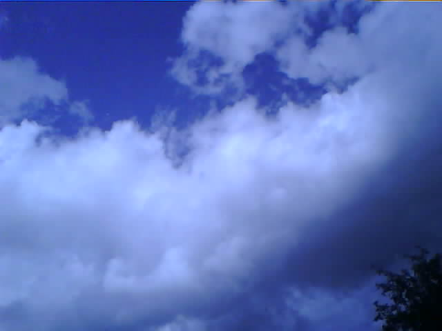
OV5640 | 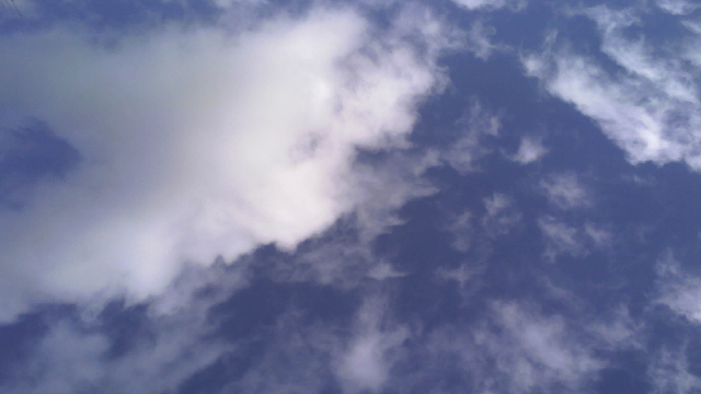
DSLR | 

While colour space based operations are fairly easy on high quality images, the OV2460 is not high quality. Contrast is low, over/under-exposure are almost ensured and ISO changes are not only drastic but cause unwanted light filtering and other strange behaviour.
The OV5640 seems more suited to this application due to it's 5MP shooting capability and higher dynamic range. Contrast, color accuracy, and exposure can be handled dynamically and are stepped up/down smoothly. This seems to also be bared out in our data.

## 3.1. Object Segmentation

To distinguish initially between Sky and Cloud regions, for each reference image, a segmented image is made where "sky" regions are coloured as black, and "cloud" regions are coloured as red.
The boundary between cloud and sky is left bare as to not muddy results.

Reference Image            |  Blocked Image
:-------------------------:|:-------------------------:|
  |  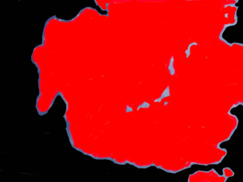

<br>

This is used to create two binary masks.

<br>

Cloud Mask Bitmap          |  Sky Mask bitmap
:-------------------------:|:-------------------------:|
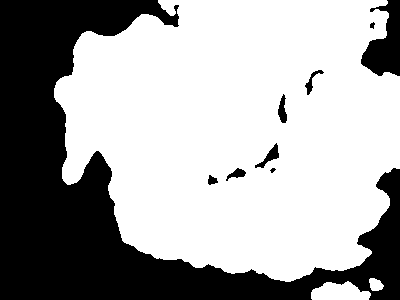  |  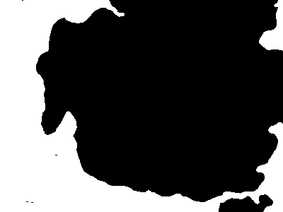 

<br>

Then subsequent masked images of the reference image, one for the clouds and one for the sky in the scene.

<br>

Cloud Masked Image          |  Sky Masked Image
:-------------------------:|:-------------------------:|
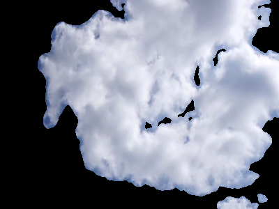  |  

These are split, iterated over and their colour channel values recorded as a frequency distribution.

The following shows the frequency graphs for the colour channels of the 60 images of the sky, separated into regions of sky and cloud.

Desc. | Histogram
:-----------------------------------:|:------------------------------------:|
RGB Distribution | 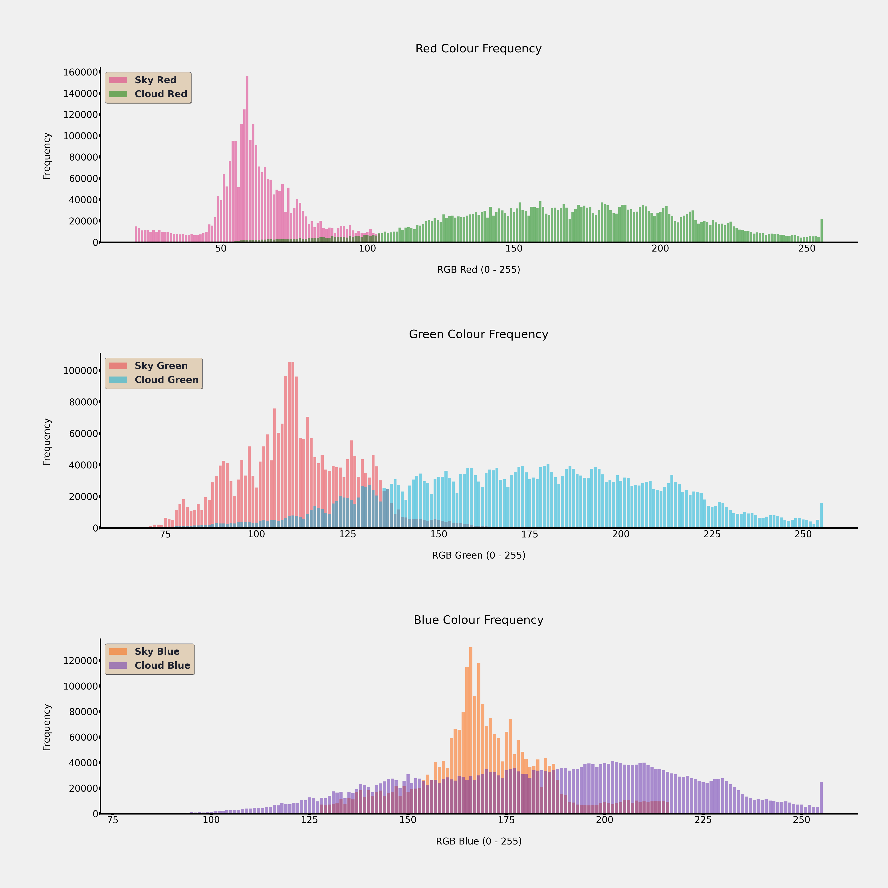 
HSv Distribution | 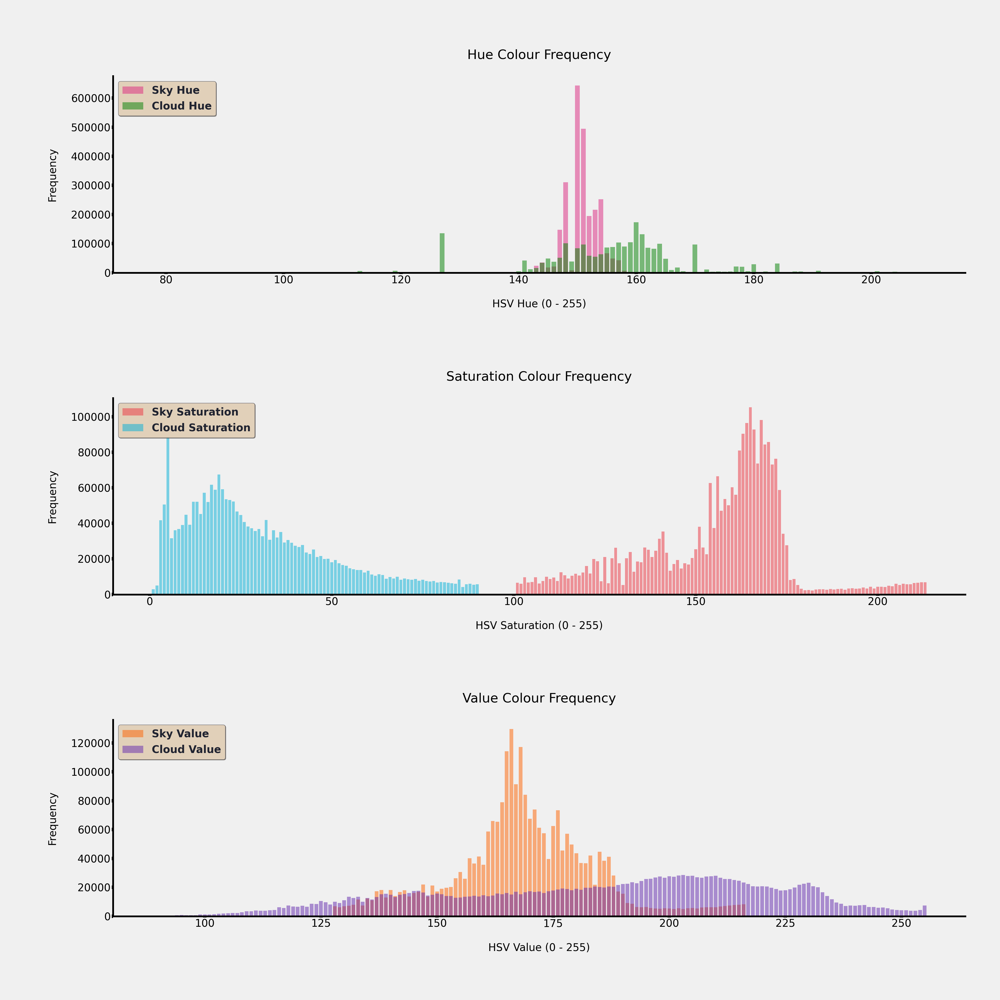
YCbCr Distribution | 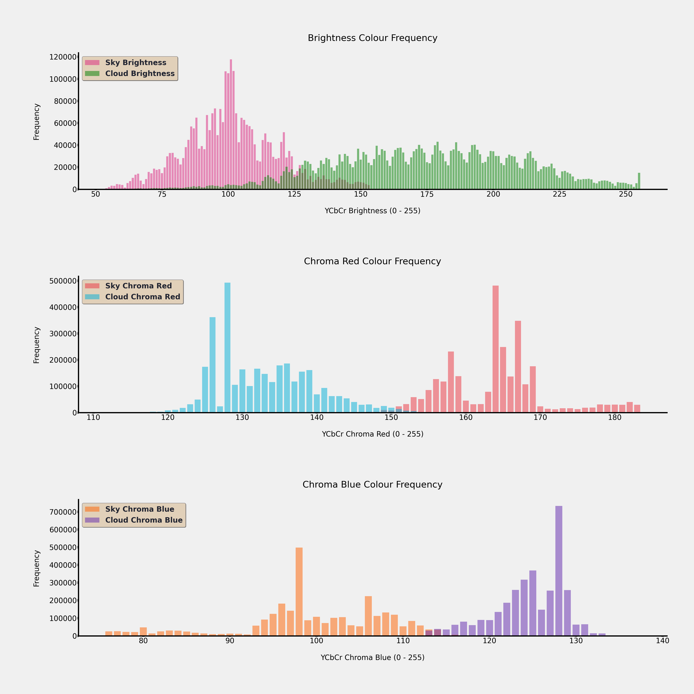

<br>

Above we see that the Saturation channel, as well as Chroma Read and Blue would be good for discriminating between sky and cloud areas.

<br>

The "usefulness" of channels however, should intuitively depend on factors such as the frequency response of the particular camera model.
This is borne out in our results as you will see below, as camera models differ in the the channels which are quantifiably "useful".

<br>

## 3.2. Channel Distribution Similarity

To quantify the similarity between the distributions for the cloud and sky portions within the dataset, we used the Jaccard index [25](Jaccard 1901). This is a widely applicable method of quantifying the similarity between to sets. It is normally defined as the intersection size divided by the union size. 
The Jaccard index was calculated for our DSLR group on the three (3) colour spaces, as well as the OV5640. The top channels under 0.5 similarity for each is taken. The results are as follows:

<br>

Camera | Jaccard Dictionary
:-----------------------------------:|:------------------------------------:|
DSLR| 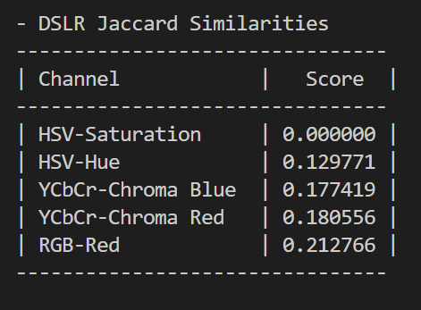 
OV5640 | 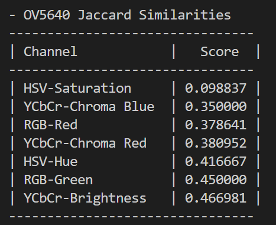

From here we can see that both the scores and their rankings within the sorted dictionaries are different. Channels such as Green and YCbCr Brightness are not present in the results for the DSLR whilst appearing for the OV5640 group.

<br>

## 3.3. ROC Curve

### 3.3.1. BootStrapping
* TODO

<br>

To now further refine the choice of colour channels, we construct ROC curves of the possible upper and lower bounds used for masking in a given channel, to quantify its ability to classify the pixels as either "cloud" or "sky". 

<br>

ROC curves illustrate the performance of a binary classifier model at varying threshold values. As such, they are not used in testing two simultaneous variables, but just one. To remedy this, we fix each lower bound at a given value, then test all feasible upper bounds, and visualize this as an independent curve. This means that for each channel, we get multiple curves on the same plot, each showing the performance of simple masking given the fixed lower bound and a number of possible upper bounds. An example is this is below - The Saturation Channel in the HSV Colourspace for the DSLR groups:

Camera | Saturation ROC Curve | Chrome Blue ROC Curve
:-----------------------------------:|:------------------------------------:|:------------------------------------:|
DSLR | 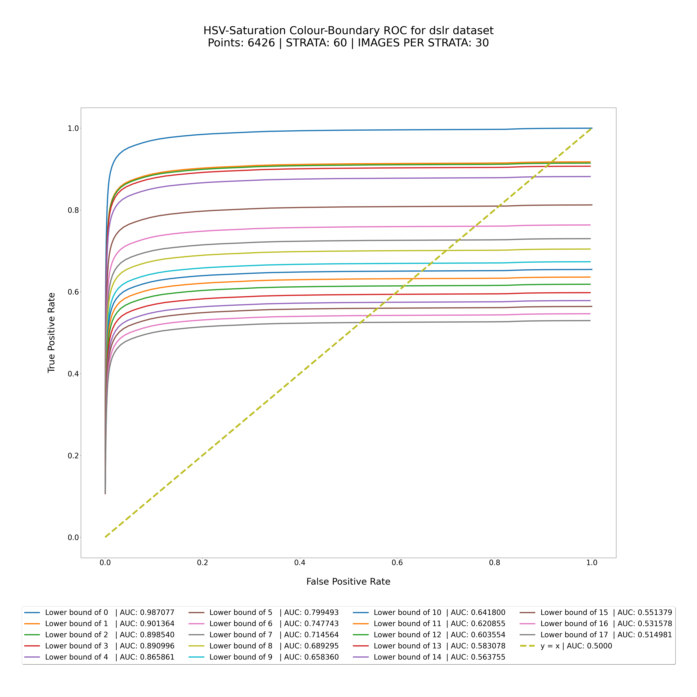 |  | 
OV5640 | 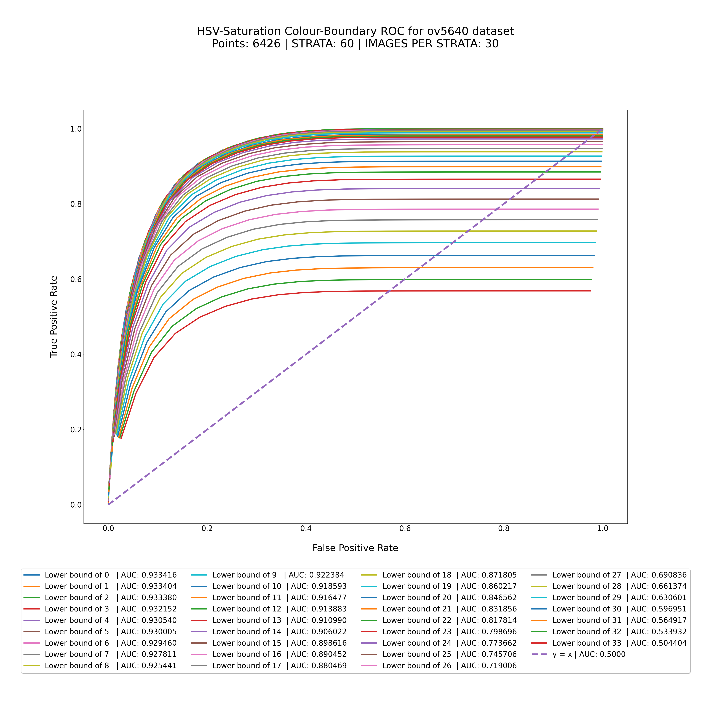|  | 


### 3.3.2. Best Curve Determination 
The difficulty comes now in determining the best lower bound via these curves. Normally, an easy measure would be to determine this via the AUC(Area Under the Curve). However, as the lower bound increases, the number of corresponding upper bounds lessons, meaning this determination becomes more complicated as smaller lower-bound values may have an "advantage" in that they have more datapoints, making for a larger curve. As most valid masking ranges seem to cover most of the distribution at a time however, this seems to not affect the result greatly.

<br>

As said, we select the curve with the highest AUC. If a channel does not contain a curve with at least an AUC of 0.5, it is discarded. 
To then select the maximal point on the graph, this can be done in many ways. The criterion for selecting this point many times comes down to business priorities rather than mathematically. In our case however, we have opted to obtain this by selecting the point which maximizes the equation TPR−FPR (True Positive Rate minus False Positive Rate).

<br>

Filtering for the best Channels from the ov5640 and DSLR datasets leaves us with the following:

Camera | Optimal Channel Characteristics
:-----------------------------------:|:------------------------------------:|
DSLR | 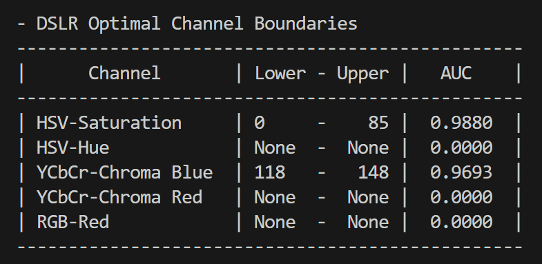
OV5640 | 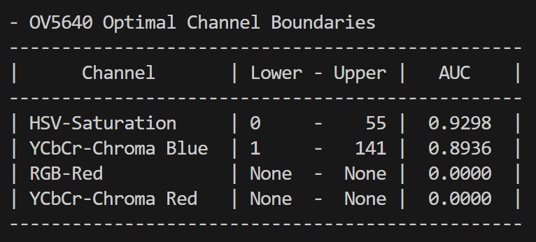


# 4.0. LCL (Lifted Condensate Level) Accuracy

The Lifted Condensate Level can be be used in estimating the cloud-base height when only sufficient environmental readings are available.
We estimate this according to the method outlined in Romps. D (2017), using the code made available from that publication within our application stack.
To visualize the difference in cloud-base versus LCL measurement, we retroactively fetch METAR data for a Set of Airports, and visualize the fractional delta and simple 1-to-1 
comparison in their results. 
We previously compared this fractional delta to the pressure, relative humidity, and temperature, to investigate their relationships, however, the relative humidity alone seemed
somewhat directly correlated. 

<br>

Through web-scraping [Ogimet](http://www.ogimet.com/), we have made available METAR data from 01/01/2010 to 30/12/2023 for both the Vaxjo and Heartsfield-Jackson (Atlanta) airports.
THese are viewable for [Växjö here](Devinci/METAR/data/ESMX/) and [ATL here](Devinci/METAR/data/KATL/)

<br>

Firstly, the vaxjo airport was investigated due to proximity. Below we see the graph for the entirety of the period:

Airport | LCL Graph
:-----------------------------------:|:------------------------------------:|
ESMX | 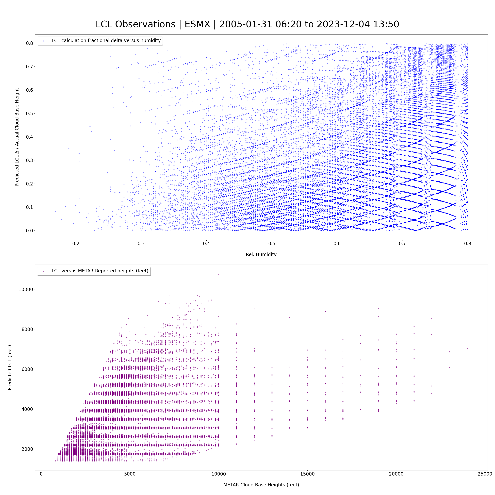
KATL | 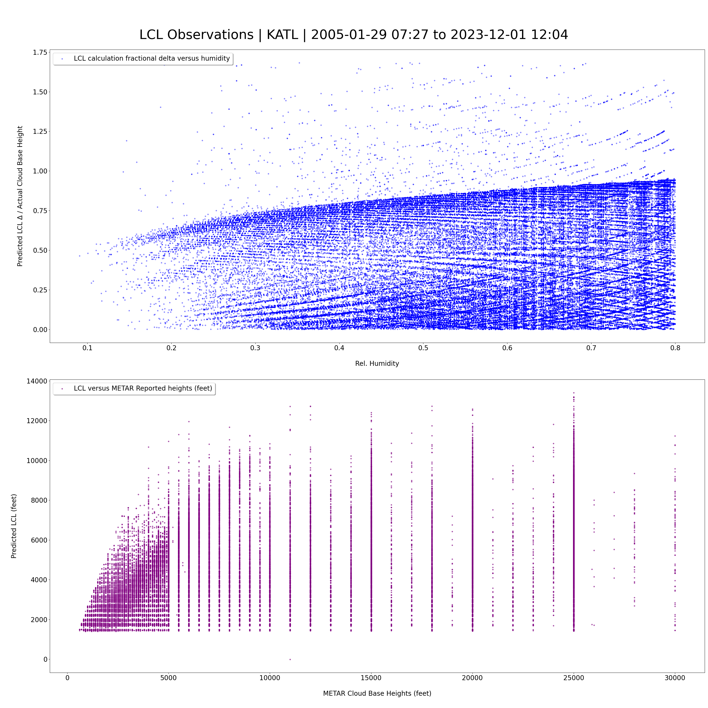 

# References
[1] The National Oceanic and Atmospheric Administration. 16 November 2012. p. 60.

[2] MISR 17.6 KM GRIDDED CLOUD MOTION VECTORS: OVERVIEW AND ASSESSMENT, Jet Propulsion Laboratory, 4800 Oak Grove, Pasadena, California, K. Mueller, M. Garay, C. Moroney, V. Jovanovic (2012).

[3]  Ceilometer-Based Rain-Rate Estimation: A Case-Study Comparison With S-Band Radar and Disdrometer Retrievals in the Context of VORTEX-SE, F .Rocadenbosch, R. Barragán , S.J. Frasier ,J. Waldinger, D.D. Turner , R.L. Tanamachi, D.T. Dawson (2020) Available: here (Accessed May 19, 2023)

[4] “Misr: Spatial resolution,” NASA, Available: here (Accessed May 19, 2023).

[5] An Extremely-Low Cost Ground-Based Whole Sky Imager, Jain, Mayank & Gollini, Isabella & Bertolotto, Michela & McArdle, Gavin & Dev, Soumyabrata. July 2021. Available: here

[6] A Simplified Analytical Method to Calculate the Lifting Condensation Level from a Skew-T Log-P Chart. Avances en Ciencias e Ingenieria. 7. C124-C129 (Extras), Muñoz, Erith & Mundaray, Rafael & Falcon, Nelson, 2015.

[7] Wmo, “Cumulonimbus,” International Cloud Atlas. Available: here (accessed May 21, 2023)

[8] The Relationship between Relative Humidity and the Dewpoint Temperature in Moist Air: A Simple Conversion and Applications. Bulletin of the American Meteorological Society 86(2) pp. 225-234, Lawrence, M. (2005). Available at: here (Accessed 5 Sep 2023)

[9] Exact Expression for the Lifting Condensation Level. Journal of the Atmospheric Sciences 74(12) pp. 3891-3900, Romps, D. (2017). Available: here (Accessed 26 Jan 2024). 

[10] Meteosat Third Generation, EUMETSTAT, Jan 2021, Available: here

[11] The SEVIRI Instrument, J. Schmid, January 2000, Available: here

[12] CL31 Ceilometer for Cloud Height Detection, Vaisala, 2009 Available: here

[13] Estimating Geo‐Referenced Cloud‐Base Height With Whole‐Sky Imagers. Earth and Space Science, Lyu, Baolei & Chen, Yang & Guan, Yuqiu & Gao, Tianlei & Liu, Jun. August 2021. Available: here

[14]  All-sky photogrammetry techniques to georeference a cloud field. Atmospheric Measurement Techniques, Crispel, Pierre & Roberts, Gregory , January 2018. Available: here

[15] Camera Calibration and 3D Reconstruction, OpenCV - Open Source Computer Vision, 31 Jan 2024. Available: here

[16] DIY Weather Station With ESP32, AutoDesk Instructables, Giovanni Aggiustatutto, Available:  here

[17] ESP32 Weather Station with Weather Forecast, Wireless Sensors and Air Quality Measurement, Harald Kreuzer, 29 June 2023, Available: here

[18] Create A Simple ESP32 Weather Station With BME280, LastMinuteEngineers, Available: here

[19] Complete DIY Raspberry Pi Weather Station With Software, AutoDesk Instructables, spacemanlabs, Available: here

[20] MWS-M625,  Intellisense Systems, Inc, 21041 S. Western Ave, Torrance, CA 90501. Available: here

[21] Real Time Weather Monitoring using IoT, Puja Sharma, Shiva Prakash, ITM Web of Conferences 40(3):01006, August 2021, Available: here

[22]  Retrieving Cloud Characteristics from Ground-Based Daytime Color All-Sky Images. Journal of Atmospheric and Oceanic Technology, Long, Charles & Sabburg, J. & Calbó, Josep & Pages, David. (2006). - J ATMOS OCEAN TECHNOL. 23. 10.1175/JTECH1875.1.
Available: here

[23]  WAHRSIS: A low-cost high-resolution whole sky imager with near-infrared capabilities. Proceedings of SPIE - The International Society for Optical Engineering, Dev, Soumyabrata & Savoy, Florian & Lee, Yee Hui & Winkler, Stefan. May 2014, Available: here

[24] LAMSkyCam: A Low-cost and Miniature Ground-based Sky Camera. HardwareX, Jain, Mayank & Sengar, Vishal & Gollini, Isabella & Bertolotto, Michela & McArdle, Gavin & Dev, Soumyabrata. August 2022 Available: here
