# Cost-Focused Weather Tracking
### (Cloud Categorization & Tracking)  

- By: Tadj Cazaubon (tc222gf)

## Proposal


Quick yet accurate Weather prediction is imperative for certain industries to now only survive,
but simply exist. An important factor of these is the ability to track, categorize and predict
movements of clouds within a given area.

The main tool in determining cloud characteristics is a ceiolmeter, which uses a laser/light source to determine a cloud's base or ceiling height. A Ceilometer usually can also measure aerosol concentration in air [1]. The downside is that ceilometers have a relatively small area of measurement directly
above the unit (~8km2) which would not be an issue, however, as of 2020 they can cost around USD $30 000 per unit [3].
There exists however, high quality satellite data made available by NASA. The new MISR Level 2 Cloud product contains height-resolved, cloud motion vectors at 17.6 km resolution; cloud top heights at 1.1 km resolution; and cross-track cloud motion components at 1.1 km resolution [2]. Now this data is made available to be used by software engineers to visualize as needed. The issue? This data is not meant for real-time application on a local area level. These products are made for global application, collecting data only on the sunlit side of earth over the course of 9 days [4]. A better solution for the local-area level must be thought of then, to better predict cloud movement and category.
<br>
The formal proposal made to VLSP can be viewed in the [Proposal](proposal.pdf)
<br>
Due to the amorphous and feature-sparse nature of Clouds, tracking them via conventional image processing techniques such as via contours, frame-to-frame motion tracking and identifiable features allowing for conventional NN training is surprisingly difficult.
However, I believe:

1. Accurately tracking/identifying clouds may be as simple as identifying them via a statistical analysis of their colour values across multiple colour spaces.

2. Cloud categorization may be done via a combination of atmospheric readings, as well as the colour analysis. 

3. With the cloud base height, location and frame to frame motion of a cloud available to us, we can assign velocity vectors to cloud structures, along with the area of   effect for their shadows on the ground.

<br>

My proposal is the construction of a number of 'weather stations' which take atmospheric readings and images of the sky above them. The data is sent back to a central server and analysed. 

The following is an attempt to put into practice the most current research to create a mesh network of these weather staions which can detect, track, and categorize clouds.

## Setup

### ESP32-S3
An Esp32-S3 with an OV5640 DVP camera module is pointed at the sky at a location and predetermined angle (prefereably perpendicular).

1. An SHT31-D takes Relative Humidity and Temperature readings.
2. A BMP390 takes Air Pressure readings.
3. The Dewpoint is calculated according using the Magnus-Tetens formula [8].
4. An image of the sky is taken with the OV5640.
5. The image and readings are sent to a collections server for analysis.

This server portion can found [Here](https://github.com/sudoDeVinci/CloudMeshVLSPDB).

### Pi Pico W / Secondary Pi Pico
A Pi Pico W is connected to the ESP32 over UART, as well as the same WiFi access point the ESP32 is connected to. The pico:

1. Send interrupt signals to the pico to receive UART data strings.
2. Relay system status messages.
3. Reset the device in case of faulty update.
4. Change system config files on the ESP32  SD card.


## How

Microcontrollers are programmed using Arduino Studio.
I mostly use VScode for programming. 

* Earlier within the project I used either  micropython and python for all components. I languages switched due to speed, memory and compatibility concerns.

[Server components](src/server_components/) are made in Java, and [microcontrollers](src/onboard/) are programmed in C. Graphing components for now are stil made in python for simplicity, but I plan to write these in JavaCV to integrate them within [Server components](src/server_components/).

Sometimes however, I use [adafruit ampy](https://learn.adafruit.com/micropython-basics-load-files-and-run-code/install-ampy) for interfacing with the boards due to needing more complex operations, such as the [utility](/utility/) scripts. This was mainly used before the switch, but readers may find use in these.
Many of the utility board functions are alternatively available through esp-IDF, but setup and use of it are memory intensive and complex. My development machine (2C4T Celeron J4125 w/ 8GB DDR4) simply cant take it.

### ESP32-S3

The ESP32-S3-OTG Dev board by Freenove was chosen because of:
1. Better vector instructions for image handling.
2. Insanely better power efficiency.
3. Increased flash memory.
4. OTG capability.

#### Reading from sensors
To read from the SHT31-D, we use the Adafruit_SHT31 library. 
To read from the BMP390, we use the Adafruit_BMP3XX libray.
We will be connecting these on the same serial bus to the esp, as they occupy different addresses (0x44 and 0x77 respectively). We use pins not occupied by the cameras on internal serial operations (41 and 42). We use the Wire library to make an instance with these as our SDA and SCL for Serial Bus 0.

* Remember to have 3.3kΩ pull-up resistors (at least 2KΩ seems to work fine).

To make things easier, I store pointers to alot of my sensors and networking related objects in structs.

<br>

Sensor state object defined in sensors.h:

```cpp
struct Sensors {
    TwoWire *wire;
    Adafruit_BMP3XX BMP;
    Adafruit_SHT31 SHT;
    camera_fb_t *CAM;

    struct Status {
        bool CAM = false;
        bool SHT = false;
        bool BMP = false;
        bool WIFI = false;
    }status;
};
```

<br>

Network profile object defined in comm.h:

```cpp
struct Network {
    const char* SSID;
    const char* PASS;
    const char* CERT;
    IPAddress HOST;
    IPAddress GATEWAY;
    IPAddress DNS;
    WiFiClientSecure *CLIENT;
    tm TIMEINFO;
    time_t NOW;
};
```

<br>

I use pointers so that I can have a majority of these functions in separate cpp files to separate responsibility. Sensor related functionality is in [sensors.cpp](src/onboard/httpsmain/sensors.cpp), and networking related functionality is in [comm.cpp](src/onboard/httpsmain/comm.cpp). 
Pointers are also useful so that the structures containing them can be kept within a global scope, but mutated within methods. I find this helps keep memory management simple.

#### Notes on Memory
To try to squeeze out the largest amount of space possible for images, memory management is important. This however is weighed against the fact that many of the libraries use Strings. Due to the sequential nature of execution, not many strings must be held in memory at any given time, however, their use can cause fragmentation of the heap overtime. This is addressed mostly using reserve() when creating strings and letting those same strings go out of scope from their creation. If a string is used in the main loop, it must be directly freed.

```cpp
String generateHeader(MIMEType type, int bodyLength, IPAddress HOST, String macAddress, String timestamp) {

  String mimeType = MIMEStr[static_cast<int>(type)];

  int end = strlen("\r\n");

  int headerLength = HeaderStr[0].length() + end +
                     HeaderStr[1].length() + HOST.toString().length() + end +
                     HeaderStr[2].length() + mimeType.length() + end + 
                     HeaderStr[3].length() + end + 
                     HeaderStr[4].length() + String(bodyLength).length() + end +
                     HeaderStr[5].length() + macAddress.length() + end +
                     HeaderStr[6].length() + timestamp.length();


  String header;
  header.reserve(headerLength+1);

  header += HeaderStr[0]+"\r\n";
  header += HeaderStr[1] + HOST.toString() + "\r\n";
  header += HeaderStr[2] + mimeType +"\r\n";
  header += HeaderStr[3] + "\r\n";
  header += HeaderStr[4] + String(bodyLength) + "\r\n";
  header += HeaderStr[5] + macAddress + "\r\n";
  header += HeaderStr[6] + timestamp + "\r\n";
  
  return header;
}
```

<br>

### Notes on Power

|State|ESP32-S3|Pi Pico W|
|-----|--------|---------|
|Antenna Off| | 0.20 A|
|Antennae On| 0.30 A| |
|Wi-Fi Connected| 0.30 A : 1.40 W| |
|Light Sleep|0.14 A : 0.651 W| |
|Deep Sleep| | 0.13 A|

<br>

I choose manual packet construction over JSON, as I need to both be able to add new headers like the timestamp and MacAdress, but also use the WiFiClientSecure Library for communication.

## Analysis

### Image Quality Requirements

#### OV5640
Not Yet Available.
<br>

#### OV2460
While colour space based operations are fairly easy on high quality images, the OV2460 is not high quality. Contrast is low, over/under-exposure are almost ensured and ISO changes are not only drastic but cause unwanted light filtering and other strange behaviour:


### Colourspace Frequency Histogram

First is graphing the frequencies of the BGR and HSV values for clouds versus the sky surrounding them. This is done in [colour_graphs](colour_graphs.py).
Each reference image in [Reference-Images](Reference-Images/) has a corresponding image in [Blocked-Images](Blocked-Images/).

Reference Image            |  Blocked Image
:-------------------------:|:-------------------------:
  |  

The Blocked out images are coloured such that clouds are coloured red and the sky is coloured black. Small borders around clouds are left as to not capture the noise of whispy cloud edges.
This is used to create two binary images and subsequent masked images of the reference image, one for the clouds and one for the sky in the scene. These are split, iterated over and their colour values recorded. These values are then graphed and can viewed below.
NOTE: The divisons in the bar graphs is an artifact from saving the graphs as pngs, as the pdf versions do not contain these.

#### Frequency Chart for High Res Images
<br>

These show the frequency graphs for the colour channels of the 60 images of the sky, separated into regions of sky and cloud.

DSLR BGR Bar Graph            |  DSLR HSV Bar Graph
:-------------------------:|:-------------------------:
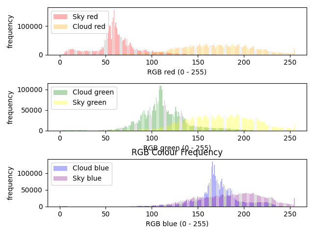  |  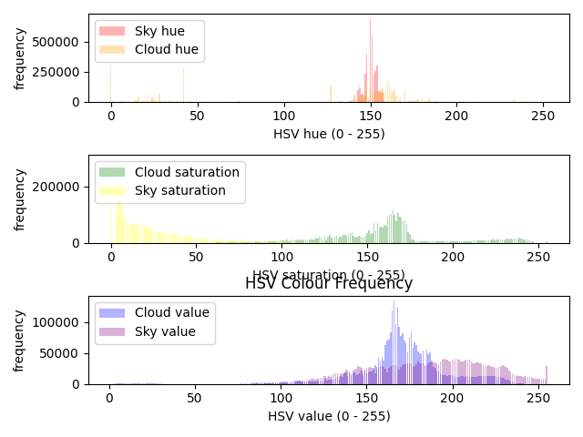

<br>

Above we that viusally, the distributions for these images could be approximated to either normal or beta distributions if properly cleaned, especially that of the clouds.
It is also apparent that the Red and Green colour space would be more useful in the pursuit to classify data.

Above we see that for the most part, only the Saturation channel would be useful for separation/classification, but that the separation between them is more prominent than in other colour channels.

#### Frequency Chart for OV2640
<br>

These show the frequency graphs for the colour channels of the 20 images of the sky taken with the OV2640, separated into regions of sky and cloud. 

OV2640 BGR Bar Graph            |  OV2640 HSV Bar Graph
:-------------------------:|:-------------------------:
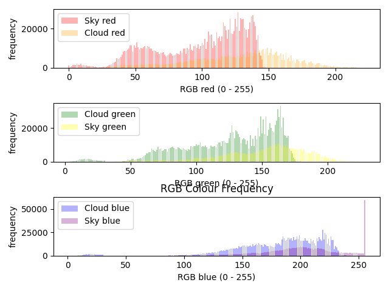  |  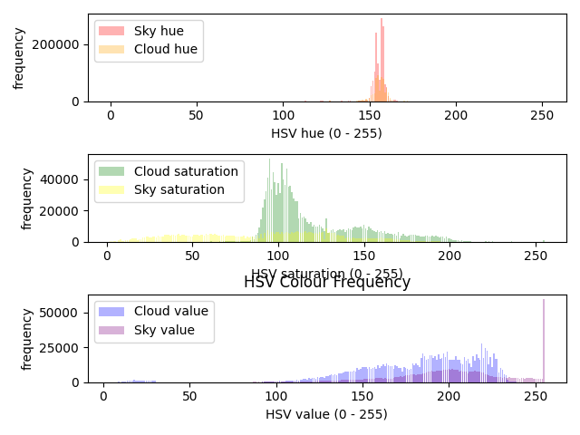

<br>

Above we see that while the pattern of separation in the channels in followed, the lack of colour fidelity causes the sky regions to a more bimodal distribution. This can be seen in images where the sky looks more purple than blue, or regions of it are under/overexposed, or subject to strange tinting.

We see that the hue looks somewhat similar, the saturation and value are nothing like the higher resolution images. I attribute this to the camera querks mentioned before. The value distribution for both clouds and sky regions is completely different now, with the sky region peaking at 100, rather than closer to 150 and skewing right.

### ScreePlot
<br>

Once the percentage variance of each colour channel in differentiating cloud and sky pixels is found, these can be visualized as a ScreePlot. This is done within [pca_graphs](pca_graphs.py).

#### ScreePlot for High Res Images
<br>

These show the screeplots for the colour channels of the 60 higher resolution images of the sky, colour channels separated as principle components to check the variance percentage in differentiating sky versus cloud pixels.

**[CURRENTLY UNLABELLED.]**

DSLR BGR Scree Plot            |  DSLR HSV Scree Plot
:-------------------------:|:-------------------------:
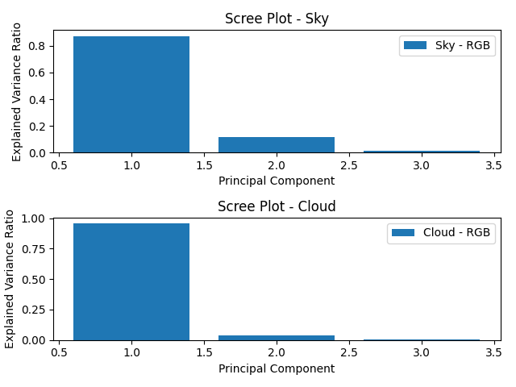  |  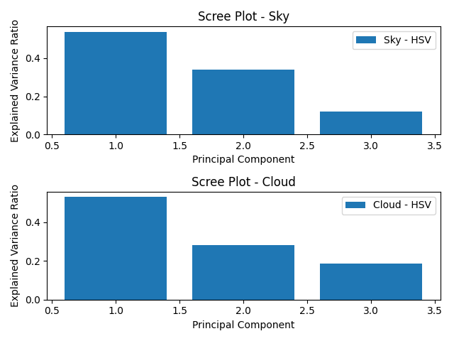

<br>

Above we see that the red channel accounts for ~80% of the variance in the cloud vs sky regions, with the green channel accounting for just under 20%. This means that in classification, the red and green channels are the main factors. We could then discard  

Above we see that the Value channel as expected leads in variance, though the next two channels are closer than one might think when looking at the distribution graphs. Still, the variance of the Value channel alone is almost as much as the other two channels combined (~50%). 

#### ScreePlots for OV2640
<br>

These show the screeplots for the colour channels of the 20 images of the sky taken with the OV2640, colour channels separated as principle components to check the variance percentage in differentiating sky versus cloud pixels.

OV2640 BGR Scree Plot            |  OV2640 HSV Scree Plot
:-------------------------:|:-------------------------:
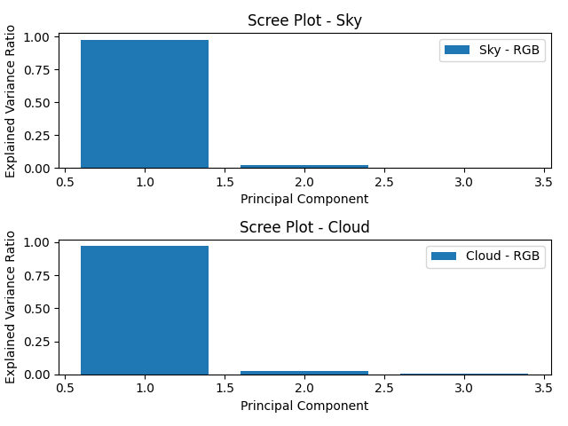  |  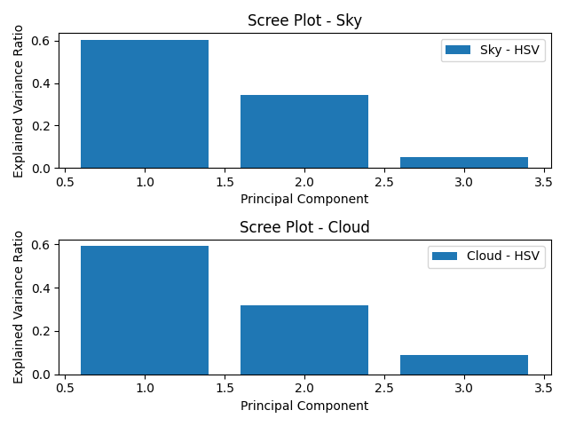

<br>

Above we see that the screeplot for the BGR channels is similar to that of that higher resolution images, despite the lack of image fidelity.

Above we see that there is an even smaller difference between the respective channels, meaning that using them to differentiate the two data sets is more difficult. The channel variance percents do however follow the expected scale.

### PCA ScatterPlot
<br>

Once a matrix of principle components (colour channels) and their per variance values is obtained, these can be visulaized in a PCA Plot. The Data is split into two (cloud pixel variance and sky pixel variance matrices respectively) to allow for better labelling. The two highest variance PCs are then graphed onto a Principle component scatterplot of sky versus cloud pixels. This is the second part of [pca_graphs](pca_graphs.py).

#### PCA ScatterPlot for High Res Images
<br>

DSLR PCA BGR ScatterPLot            |  DSLR PCA HSV Scatterplot
:-------------------------:|:-------------------------:
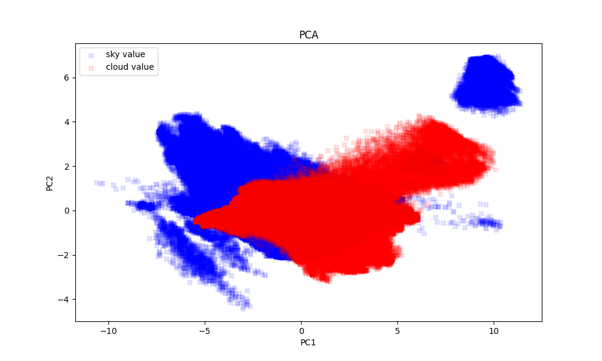  |  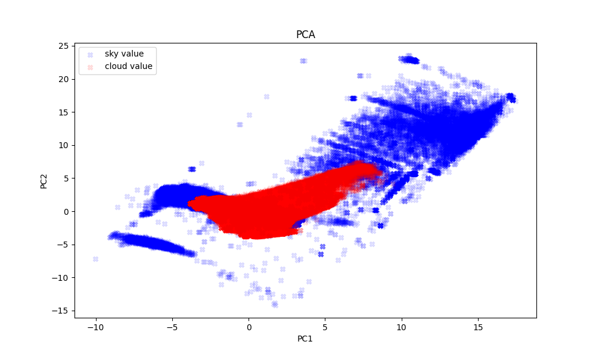

#### PCA ScatterPlot for OV2640
<br>

OV2640 PCA BGR ScatterPLot            |  OV2640 PCA HSV Scatterplot
:-------------------------:|:-------------------------:
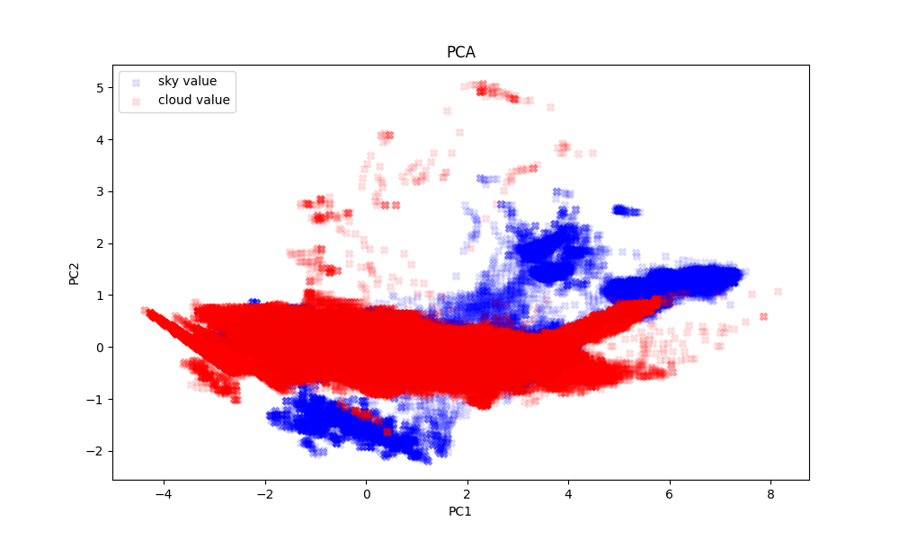  |  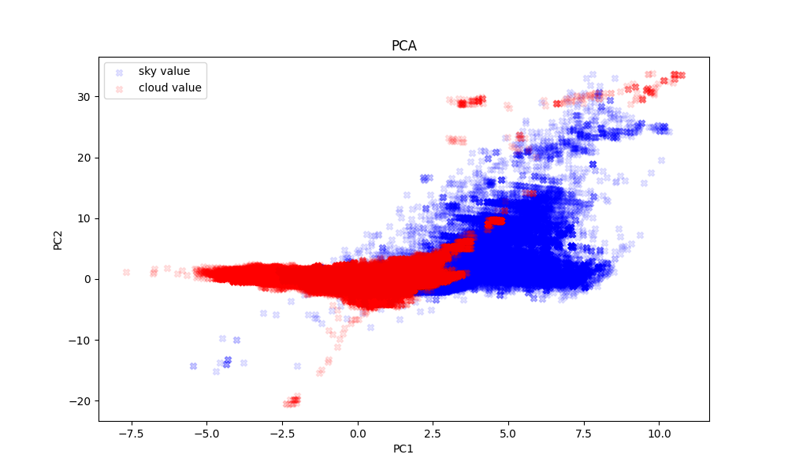


### Final Comments

- It can be seen that sky and cloud regions can be separated somewhat via visible colour space, and this separation simplified via singular value decomposition. The OV2640 however, can be seen to not be suitable for this application however; though following the statistical trends of the higher resolution images, it lacks the image quality/colour fidelity needed for this application.

## References

[1] The National Oceanic and Atmospheric Administration. 16 November 2012. p. 60.

[2] K. Mueller, M. Garay, C. Moroney, V. Jovanovic (2012). MISR 17.6 KM GRIDDED CLOUD
MOTION VECTORS: OVERVIEW AND ASSESSMENT, Jet Propulsion Laboratory, 4800 Oak
Grove, Pasadena, California.

[3] F .Rocadenbosch, R. Barragán , S.J. Frasier ,J. Waldinger, D.D. Turner , R.L. Tanamachi, D.T. Dawson (2020) Ceilometer-Based Rain-Rate Estimation: A Case-Study Comparison With S-Band Radar and Disdrometer Retrievals in the Context of VORTEX-SE

[4] “Misr: Spatial resolution,” NASA, https://misr.jpl.nasa.gov/mission/misr-instrument/spatial-resolution/ (accessed May 19, 2023).

[5] “tlcl_rh_bolton,” Tlcl_rh_bolton,
https://www.ncl.ucar.edu/Document/Functions/Contributed/tlcl_rh_bolton.shtml (accessed May 21, 2023) (Extras)

[6] Muñoz, Erith & Mundaray, Rafael & Falcon, Nelson. (2015). A Simplified Analytical Method to Calculate the Lifting Condensation Level from a Skew-T Log-P Chart. Avances en Ciencias e
Ingenieria. 7. C124-C129 (Extras)

[7] Wmo, “Cumulonimbus,” International Cloud Atlas, https://cloudatlas.wmo.int/en/observation-of-clouds-from-aircraft-descriptions-cumulonimbus.html (accessed May 21, 2023)

[8] Lawrence, M. (2005). The Relationship between Relative Humidity and the Dewpoint Temperature in Moist Air: A Simple Conversion and Applications. Bulletin of the American Meteorological Society 86(2) pp. 225-234. Available at: https://journals.ametsoc.org/view/journals/bams/86/2/bams-86-2-225.xml [Accessed 5 Sep 2023]