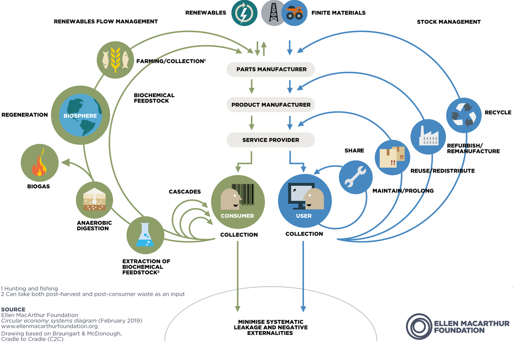

# Work Placement Report

## Student Details

**Name:** Tadj Cazaubon  
**Email:** tc222gf@student.lnu.se  
**Mobile:** (+46) 707213048

## 1. Company details

**Company:** Växjö Linnæus Science Park AB

**Address:** Växjö Linnæus Science Park, Framtidsvägen 14, 352 22 Växjö

**Description:** Växjö Linnæus Science Park AB is owned by the municipality of Växjö and is run in
collaboration with business, the regional innovation support system and academia. The aim is
to build a supportive and inspiring community for entrepreneurs. The goal is for companies to
become even more successful. Able to grow and take new market shares.
Swedish Incubators & Science Parks (SISP) is the Swedish industry association for Sweden's incubators and science parks. SISP has 62 members all over Sweden who together run approx. 80 physical meeting places, offer operational business development, often run or collaborate with clusters and have triple helix anchoring. [1]

**Historical:** Since 1986, Växjö municipality has had a company that worked with both real estate and business development through science park operations: Videum AB / Videum Science Park.  At the turn of the year 2021/2022, the science park operations were transferred to a completely new company - Växjö Linnæus Science Park. [1]. In 1989 SwedePark is formed as an association for research and technology parks. In 1999 SwedSpin is formed as an association for business incubators. In 2005 SwedSpin and SwedePark merge and form Swedish Incubators & Science Parks, and 2011 Swedish Incubators & Science Parks opens its officies [2].

## 2. Business Model

Växjö Linnæus Science Park has a number of key focus areas. The focus areas are selected based on the needs of business, the academy's strengths and Växjö Municipality's areas of interest.

### 2.1. Circular Economy

VLSP puts an enormous emphasis on their goal for facilitating a circular economy. The Ellen MacArthur Foundation is referenced in their explainations on this topic, according to which, a circular economy is:

*"a system where materials never become waste and nature is regenerated. In a circular economy, products and materials are kept in circulation through processes like maintenance, reuse, refurbishment, remanufacture, recycling, and composting"*[4].

VLSP believes that in order for to acheive Sweden's emisison reduction target of zero net emissions by 2045, a move from a linear to a circular economy is crucial. To illustrate this, they split the circulation of materials in the economy into two distinct 'flows'; *biological*, whereby materials are returned to the biospere and *technical*, whereby materials circulate in industrial processes.

An example of this is illustrated on the VLSP website in a diagram taken from the Ellen Macarthur Foundation [3][4]:
 

 

To accomplish this, the Science park has laid out a few key points:

- Extending the life of biological materials by designing them to be used in several different products one after the other, before returning to the biosphere
- Enabling upcycling, whereby materials circulate and maintain their quality and economic value regardless of the number of cycles.
- The closer you can get to the innermost circles of direct reuse, the greater the savings, as the need for new extraction of raw materials decreases and less energy is used for transport and material processing. 

### 2.2. Smart City

The smart city objective according to VLSP, is a set of projects with the goal of streamlining the city's functions while improving the quality of life for residents, with a focus on acccessibility. [5]

An example of this would be the **DigIT Hub** project aimed at small to medium-size oublic sector companies in southern Sweden to help them digitize, and become part of an established network of 'hubs'. The project includes members such as: Växjö municipality, Lund Municipality,  Malmö City, City of Helsingborg and RISE - Research Institutes of Sweden.
Information of the project can be found on their website [digithub.se](https://digithub.se)

### 2.3. Forest and Wood

VLSP pays close attention to the current climate crisis, factoring in the potential climate impact into their goals and methods of achievement. With nearly two-thrids of Sweden's area being forest, VLSP has stressed establishing incentives to build out of the abundant resource of timber.[7]  

VLSP therefore works very closely with the Municipality to facilitate common goals associated with wood building.  
This therefore reflects in the projects it chooses to sponsor and carry out, or in research carried out by contributors. An example of this would be the CEO, Fredrick Lindblad, who has personally done much work on this topic. The most often referenced in discussions being Fredrick's 2020 Article: *Växjö Municipality’s Planning Strategy to Increase the Construction of Wooden Multi-Family Buildings*[8], and his 2022 Article: *A Case Study of Växjö Municipality’s Actions to Increase the Construction of Wooden Multi-family Buildings* [9].

### 2.4. Digitization

Digitization for VLSP involves working with businesses to update, automate and therefore digitize their existing processes and information. THis may be as simple as moving from a system to physical file-keeping, to hosting files on some electronic platform, all the way to making sweeping changes to processes to automate large parts in bid for efficiency.

## 3. Task

My task was to to implment the IOT  Weather Station Mesh Network Monitoring System proof of concept laid out in my initial proposal document. 

The network consists of 4 ESP32 microcontrollers with DVP ports, equipped with a BMP390 altimeter, and SHT31-D hygrometer. These weather stations send periodic images and readings to a central server housed in the Science park. This data is then used to obtain the size, type, height and approximate velocity of the cloud, as well as host generally useful temperature readings.

Initially I was tasked to complete this between June 5th and August 11th, 2023, but since then my internship has been extended by a further 2 months.

### 3.1. Problems

The most prevelant issue was my schedule at the time. Though I was able to work remotely, I was travelling at the time and unable to access my main computer at home. This meant things like compiling code, or creating graphs of my data so far would take much longer each time as my laptop is very under-powered. In some cases, I simply couldn't run the needed tests because my laptop didn't have enough RAM. This easily set my my development schedule back over a month.

My next problem admittedly was my own fault. In ordering the ESP32 boards, I opted for newer ESP32-S3 models due to their increased flash storage, more robust vector instruction set and lower power usage. Documentation and software support for these is limited due to them being so new however, especially in my chosen language of MicroPython. The existing firmware and libraries I was using would not be compatible with the new boards. This meant I would not only have to rewrite my existing code for the Esp, but I would have to do it in the Arduino programming language, of which I was not familiar. Support within the Arduino ecosystem was of course also lacking for these boards, which set me back further.

Developement in the ArduinoIDE is also a much slower process. Whereas Micropython allows a user to upload and run pytohn files onto a board, Arduino files must be compiled first and upoloaded to the board, taking much longer during the development cycle.

### 3.2. Result

As of September 8th, 2023, 

### 3.3. Development process

#### 3.4.1 Tools

## 4. Lessons learned

## References

- [1] 'Mer om science parks', https://vaxjolinnaeussciencepark.se/om-oss
- [2] 'Historic', https://www.sisp.se/om-sisp
- [3] https://vaxjolinnaeussciencepark.se/fokusomraden/cirkular-ekonomi
- [4] https://ellenmacarthurfoundation.org/topics/circular-economy-introduction/overview
- [5] https://vaxjolinnaeussciencepark.se/fokusomraden/smarta-staden
- [6] https://vaxjolinnaeussciencepark.se/samverkansprojekt/digit-hub-sweden
- [7] https://vaxjolinnaeussciencepark.se/fokusomraden/skog-och-tra

- [8] Lindblad, Fredrik. (2020). Växjö Municipality’s Planning Strategy to Increase the Construction of Wooden Multi-Family Buildings. Sustainability. 12. 10.3390/su12124915. 
Available: https://www.researchgate.net/publication/342211480_Vaxjo_Municipality%27s_Planning_Strategy_to_Increase_the_Construction_of_Wooden_Multi-Family_Buildings

- [9] F.  Lindblad, “A case study of Växjö Municipality’s actions to increase the construction of wooden multi-family buildings,” Journal of Civil Engineering and Architecture, vol. 16, no. 5, 2022. doi:10.17265/1934-7359/2022.05.002 
Available: https://www.researchgate.net/publication/361796022_A_Case_Study_of_Vaxjo_Municipality's_Actions_to_Increase_the_Construction_of_Wooden_Multi-family_Buildings