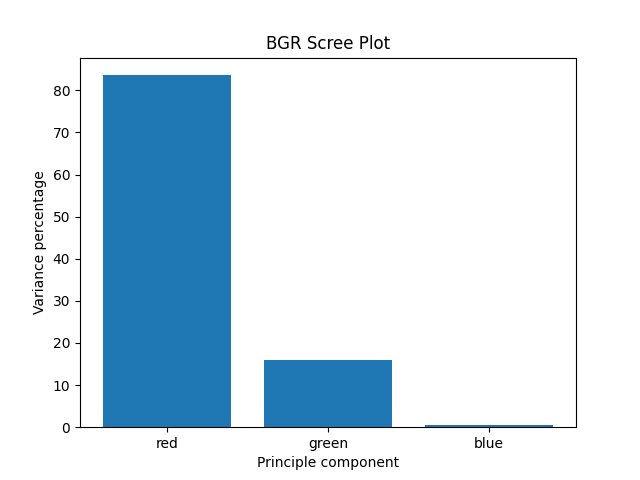
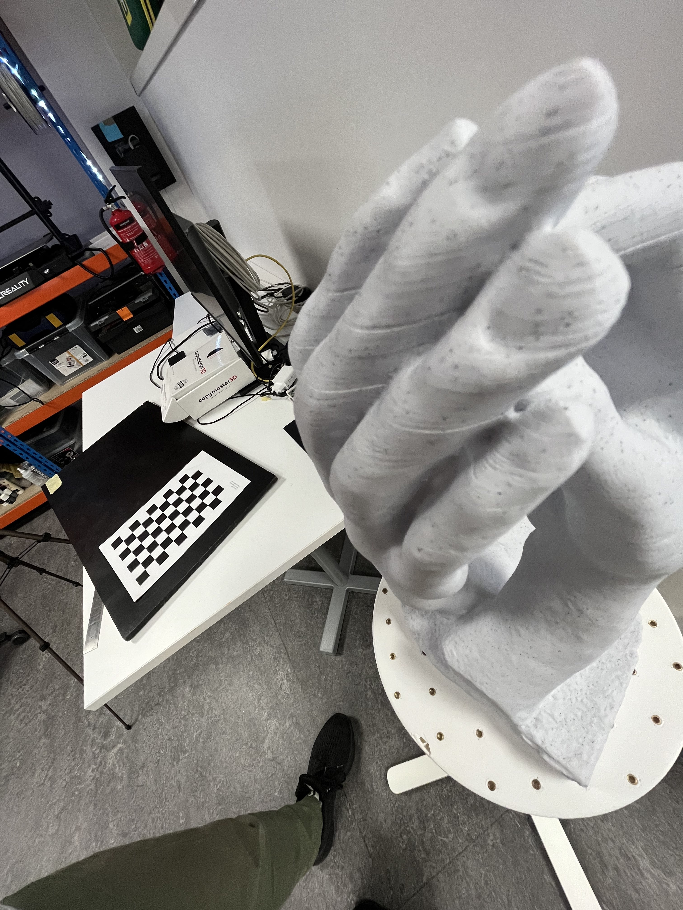

# Cloud Detection/Categorization via Visual Colour Space
#                                   OR
# A Mesh Network To Track Clouds

 

## Why?

Quick, accurate and constant weather prediction is imperative for certain industries to now only survive, but simply exist. An important factor of these is the ability to track, categorize and predict cloud cover within a given area. Ceilometers use a laser/light source to determine a cloud's base or ceiling height [1]. 

The downside is that ceilometers have a relatively small area of measurement directly above the unit and as of 2020 they can cost around USD $30 000 per unit [3].
There exists however, high quality satellite data made available by NASA [2]. This data is made available but is not meant for real-time application on a local area level. These products are made for global application, collecting data only on the sunlit side of earth over the course of 9 days [4].

 

Due to the amorphous nature of Clouds, tracking them with conventional image processing techniques is difficult.
However, accurately tracking clouds may be as simple as identifying them via a statistical analysis of their colour values across multiple colour spaces.I believe identification of clouds could come down to BGR and HSV values.

 

## Design

A microcontroller a camera is pointed at the sky at a location and predetermined angle (prefereably perpendicular). It takes a number of readings along with a picture. This gets sent to a Server.
The server then undistorts the image, and performs a statistical analysis on it to determine the category.
Secondary elements like the direction and speed can also be inferred from the images.

## What and Why

## Analysis

### Image Quality 
While colour space based operations are fairly easy on high quality images, the OV2460 is not high quality. Contrast is low, over/under-exposure are almost ensured and ISO changes are not only drastic but cause unwanted light filtering and other strange behaviour:

### Colourspace Overlap

Each reference image in [Reference-Images](Reference-Images/) has a corresponding image in [Blocked-Images](Blocked-Images/).

Reference Image            |  Blocked Image
:-------------------------:|:-------------------------:
  |  

The Blocked out images are coloured such that clouds are coloured red and the sky is coloured black. Small borders around clouds are left as to not capture the noise of whispy cloud edges.

 

These show the frequency graphs for the colour channels of the 60 images of the sky, separated into regions of sky and cloud.

### ScreePlot for Images
 

These show the screeplots for the colour channels of the 60 higher resolution images of the sky, colour channels separated as principle components to check the variance percentage in differentiating sky versus cloud pixels.

Above we see that the red channel accounts for ~80% of the variance in the cloud vs sky regions, with the green channel accounting for just under 20%. This means that in classification, the red and green channels are the main factors. We could then discard  

### PCA ScatterPlot
 

Once a matrix of principle components (colour channels) and their per variance values is obtained, these can be visulaized in a PCA Plot.
 

- It can be seen that sky and cloud regions can be separated somewhat via visible colour space, and this separation simplified via singular value decomposition.

## Cloud Base Height

An important factor here is the cloud base height. The cloud base is the lowest point of the visible portion of a cloud, usually expressed in meters above sea level/planet surface. Different cloud types exist at varying heights.

 

This can be calculated in close estimation by finding the lifted condensate level [5]. The LCL can be approximated using the dew point,humidity and temperature a few different ways. The most popular being Espy's equation, which has been shown to be satisfactory for accurate readings within 200m [6].

## Camera Calibration

In simple terms, all cameras have internal and external characteristics that distort the images. These can be expressed as matrices. Once found, we can get a distortion matrix, and therefore undo distortion. This involves finding the position of known, measured object points in our distorted image and finding the transformations done to obtain our known measurements. 

An example below shows an example image and its undistorted form.

Reference Image           |  Blocked Calibration Image
:-------------------------:|:-------------------------:
  |  

 

This undistorted image can now be used for the mapping of 3D objects of known dimensions.

## References

[1] The National Oceanic and Atmospheric Administration. 16 November 2012. p. 60.

[2] K. Mueller, M. Garay, C. Moroney, V. Jovanovic (2012). MISR 17.6 KM GRIDDED CLOUD
MOTION VECTORS: OVERVIEW AND ASSESSMENT, Jet Propulsion Laboratory, 4800 Oak
Grove, Pasadena, California.

[3] F .Rocadenbosch, R. Barragán , S.J. Frasier ,J. Waldinger, D.D. Turner , R.L. Tanamachi,
D.T. Dawson (2020) Ceilometer-Based Rain-Rate Estimation: A Case-Study Comparison With
S-Band Radar and Disdrometer Retrievals in the Context of VORTEX-SE

[4] “Misr: Spatial resolution,” NASA, https://misr.jpl.nasa.gov/mission/misr-instrument/spatial-
resolution/ (accessed May 19, 2023).

[5] “tlcl_rh_bolton,” Tlcl_rh_bolton,
https://www.ncl.ucar.edu/Document/Functions/Contributed/tlcl_rh_bolton.shtml (accessed May
21, 2023) (Extras)

[6] Muñoz, Erith & Mundaray, Rafael & Falcon, Nelson. (2015). A Simplified Analytical Method
to Calculate the Lifting Condensation Level from a Skew-T Log-P Chart. Avances en Ciencias e
Ingenieria. 7. C124-C129 (Extras)

[7] Wmo, “Cumulonimbus,” International Cloud Atlas, https://cloudatlas.wmo.int/en/observation-
of-clouds-from-aircraft-descriptions-cumulonimbus.html (accessed May 21, 2023)
